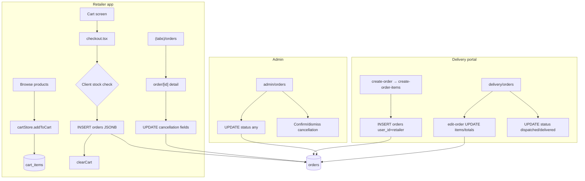
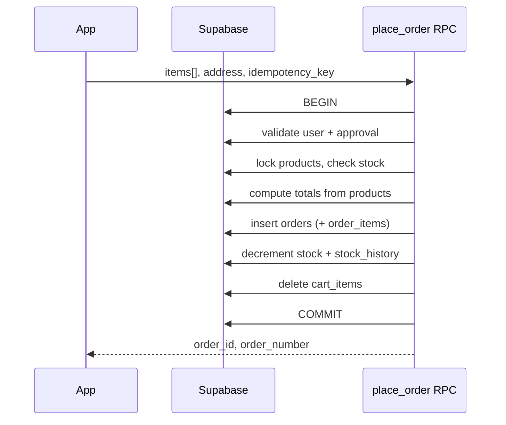

# Ordering System Audit — Thakkar Medico

**Project:** `Thakkar-Medico-Testing`  
**Scope:** Retailer self-serve ordering, delivery-assisted ordering, admin fulfillment, Supabase data layer  
**Audit date:** June 14, 2026  
**Status:** Read-only review (no code changes in this document)

---

## Table of contents

1. [Executive summary](#executive-summary)
2. [End-to-end flow](#end-to-end-flow)
3. [Overall ratings](#overall-ratings)
4. [Critical bugs](#critical-bugs-fix-first)
5. [High-severity issues](#high-severity-issues)
6. [Medium issues](#medium-issues-scale--maintainability)
7. [What works well](#what-works-well)
8. [Scalability roadmap](#scalability-roadmap-prioritized)
9. [Target architecture](#target-architecture)
10. [Quick wins](#quick-wins-small-code-changes-high-value)
11. [Improvement space summary](#improvement-space-summary)
12. [Key file reference](#key-file-reference)

---

## Executive summary

The ordering system is implemented as **direct Supabase client writes** from React Native screens. There is **no server-side order pipeline** (no RPC, Edge Function, or transactional `place_order`).

The happy path for **approved retailers** (browse → cart → checkout → order list) is understandable and has good UX for order status. For **production scale and inventory truth**, the design has serious gaps:

- Stock is checked on checkout but **never decremented**.
- **Pricing and totals are trusted from the client**, not recomputed on the server.
- **RLS policies** likely block delivery-created orders and retailer cancellation requests unless extra policies exist in production.
- **Unverified retailers** can place orders despite UI messaging that says otherwise.

**Composite score: ~4.5/10** for production at scale — adequate for a prototype; not safe for concurrent users or reliable inventory.

---

## End-to-end flow

### Flow diagram (as implemented)



### Retailer path (step by step)

| Step | Component | Data action |
|------|-----------|-------------|
| 1 | Home / products / product detail | `cartStore.addToCart` → `cart_items` insert/update |
| 2 | `(tabs)/cart.tsx` | `fetchCart` joins `products` for name, price, GST |
| 3 | `checkout.tsx` | Client stock read → `orders.insert` → `clearCart` |
| 4 | `(tabs)/orders.tsx` | Select own orders (`user_id`, limit 50) |
| 5 | `order/[id].tsx` | Detail + cancellation request update |

### Delivery path

| Step | Component | Data action |
|------|-----------|-------------|
| 1 | `delivery/create-order.tsx` | Select retailer from `profiles` |
| 2 | `delivery/create-order-items.tsx` | Build line items in memory → `orders.insert` with `user_id = retailer.id` |
| 3 | `delivery/orders.tsx` | List orders (limit 100), status updates, link to edit |
| 4 | `delivery/edit-order.tsx` | Update `items`, `subtotal`, `gst`, `grand_total` |

### Admin path

| Step | Component | Data action |
|------|-----------|-------------|
| 1 | `admin/orders.tsx` | List/filter orders (limit 100), advance or jump status |
| 2 | Cancellation queue | Confirm cancel or dismiss request |

### Database (Supabase)

- **`cart_items`:** `user_id`, `product_id`, `quantity`; unique `(user_id, product_id)`.
- **`orders`:** Single row per order; line items stored in **`items` JSONB**; totals in `subtotal`, `gst`, `grand_total`.
- **RLS:** `orders_insert_own` (insert only if `auth.uid() = user_id`), `orders_update_staff` (admin/delivery update), select own + staff.

There is **no** `order_items` table, **no** stock mutation on order events, and **no** `place_order` RPC in `supabase/setup.sql`.

---

## Overall ratings

| Area | Score (1–10) | Summary |
|------|----------------|---------|
| **Functional completeness** | 6/10 | Happy path works for retailers; delivery/cancel paths likely blocked by RLS |
| **Data integrity** | 3/10 | Client-trusted totals, no stock ledger, race on inventory |
| **Security / RLS** | 4/10 | Gaps on insert/update for staff and retailers |
| **Scalability** | 4/10 | JSONB line items, no indexes, hard `limit(100)`, large product lists |
| **Operability** | 5/10 | Good status UX; weak audit trail and fulfillment rules |
| **Code consistency** | 5/10 | Duplicate totals logic; mixed order-number strategies |

**Composite: ~4.5/10** for production at scale.

---

## Critical bugs (fix first)

### 1. Delivery cannot legally insert orders (RLS)

**Policy:** `orders_insert_own` requires `auth.uid() = user_id`.

**Code:** Delivery inserts with `user_id: retailer.id` (not the logged-in delivery user).

**File:** `app/delivery/create-order-items.tsx`

```ts
const { error } = await supabase.from('orders').insert({
  order_number: `ORD-${Date.now()}`,
  user_id: retailer.id,
  // ...
});
```

**Impact:** Unless production has an undocumented `orders_insert_staff` policy, **delivery order creation fails** at the database layer.

**Fix direction:** Add `orders_insert_staff` (or route all placement through a `SECURITY DEFINER` RPC that validates role and retailer).

---

### 2. Retailer cancellation requests likely fail (RLS)

**Code:** `app/order/[id].tsx` updates `cancellation_requested`, `cancellation_reason`, `cancellation_requested_at`.

**Policy:** Only `orders_update_staff` exists for updates (admin/delivery). No `orders_update_own` for retailers.

**Impact:** Retailers may see UI to request cancellation but **updates are rejected by RLS**.

**Fix direction:** `orders_update_own` limited to cancellation columns and allowed statuses (e.g. `pending`, `approved`).

---

### 3. Stock is never decremented

Checkout reads `products.stock_quantity` and blocks if insufficient. **No code** updates `stock_quantity` or writes `stock_history` on:

- Place order
- Approve / pack / dispatch / deliver
- Cancel (no restock)

**Impact:** **Overselling**; inventory in admin/product screens does not reflect orders.

**Fix direction:** Decrement (or reserve) inside a transactional `place_order`; restock on cancel when appropriate.

---

### 4. TOCTOU race on checkout

Flow: read stock → insert order. Two concurrent checkouts can both pass the read and insert.

**Impact:** Sold quantity can exceed `stock_quantity`.

**Fix direction:** `UPDATE products SET stock_quantity = stock_quantity - qty WHERE id = ? AND stock_quantity >= qty` inside a transaction, or row locks in RPC.

---

### 5. Unverified retailers can place orders

Home (`app/(tabs)/index.tsx`) shows “need admin approval to place orders” for `!user.approved`.

**Cart and checkout do not check `user.approved`.**

**Impact:** Any authenticated retailer can insert via `orders_insert_own`.

**Fix direction:** Enforce in RPC and gate UI on cart/checkout.

---

### 6. Client-controlled pricing

Checkout sends `subtotal`, `gst`, `grand_total`, and per-line `selling_price` from the cart store.

**Impact:** Modified client can place **wrong or zero-total orders**.

**Fix direction:** Server recomputes from `products` (+ `settings.gst_enabled`) in `place_order`.

---

### 7. Stock check can be skipped silently

In `checkout.tsx`, validation runs only inside `if (stockData)`. Empty or failed fetch does not block insert.

**Impact:** Orders can be placed **without** a successful stock validation.

**Fix direction:** Treat query error or missing products as hard failure.

---

### 8. Order success + cart not cleared

Order insert succeeds, then `clearCart()` runs. If clear fails, cart remains full.

**Impact:** User can **place duplicate orders**; no idempotency key.

**Fix direction:** Clear cart inside same transaction as order insert; optional `idempotency_key` on orders.

---

## High-severity issues

| Issue | Where | Impact |
|--------|--------|--------|
| Edit order after packed/dispatched | `delivery/orders.tsx` allows edit unless `delivered`/`cancelled`; `edit-order.tsx` has no status guard | Items/totals change mid-fulfillment |
| No status transition rules | `admin/orders.tsx` can set any status | Broken ops and reporting |
| `ORD-${Date.now()}` for delivery orders | `create-order-items.tsx` | Order number collisions under burst traffic |
| Stale cart prices at checkout | Prices from cart join at fetch time | Order snapshot ≠ current catalog |
| No stock check on add-to-cart / delivery create | `cartStore.ts`, delivery flows | Carts and orders exceed inventory |
| `gst_enabled` / `delivery_enabled` ignored | `checkout.tsx` vs `settings` | Admin toggles do not affect checkout |
| Legacy `backend-database-setup.sql` | MySQL-style example schema | Confusion vs real Supabase model |

---

## Medium issues (scale & maintainability)

1. **JSONB `items` only** — Hard to query “all orders containing product X”, aggregate sales, or FK to products.
2. **No DB indexes** on `orders(user_id)`, `orders(created_at)`, `orders(status)`, `orders(order_number)` — list queries degrade as volume grows.
3. **No `UNIQUE` on `order_number`** — Duplicates possible (especially `Date.now()`).
4. **No `CHECK` on `status`** — Invalid status strings possible.
5. **Hard caps** — Admin/delivery `limit(100)`; retailer `limit(50)` — no cursor pagination.
6. **Delivery loads all active products** — Does not scale for large catalogs.
7. **Duplicate totals/GST logic** — `checkout.tsx`, `cart.tsx`, delivery create/edit, cards — drift risk.
8. **Debug logging** — `delivery/create-order.tsx` logs all profiles to console.
9. **Cancellation while dispatched** — UI allows cancel request until `delivered`; business rule should be explicit.

---

## What works well

- Clear **status lifecycle** UI (retailer progress, admin filters, cancel-request queue).
- **Cart persistence** in Supabase with `UNIQUE (user_id, product_id)` and merge-on-add in `cartStore`.
- **RLS baseline** for retailers reading own orders and staff reading all orders.
- Retailer checkout uses **UUID fragment** for order numbers (better than timestamp).
- List screens use reasonable **FlatList** tuning (`initialNumToRender`, `removeClippedSubviews`).
- **Cancellation workflow** (request → admin confirm/dismiss) is a good product pattern once RLS is fixed.

---

## Scalability roadmap (prioritized)

### P0 — Correctness & security (before more users)

1. **`place_order` Postgres RPC** (single transaction):
   - Verify caller: approved retailer OR staff placing on behalf of retailer.
   - Lock product rows; check and decrement stock (or reserve on `pending`, commit on `approved`).
   - Recompute totals from `products` and `settings.gst_enabled`.
   - Insert order (and optionally `order_items` rows).
   - Clear `cart_items` for retailer self-serve flow.
   - Write `stock_history`.
   - Support **idempotency key** to prevent duplicate submits.

2. **RLS fixes:**
   - `orders_insert_staff` for delivery/admin with safe `WITH CHECK` (e.g. `user_id` is a retailer profile).
   - `orders_update_own` for retailers: only cancellation fields, only early statuses.

3. **Enforce `approved`** in RPC and UI on checkout.

### P1 — Data model

4. Normalize **`order_items`** (`order_id`, `product_id`, `quantity`, `unit_price`, `gst_percent`, line totals).
5. Add indexes + **`UNIQUE(order_number)`** + **`status` CHECK** constraint.
6. **`order_status_events`** (`order_id`, `from_status`, `to_status`, `actor_id`, `created_at`) for audit.

### P2 — Product & ops scale

7. **Keyset pagination** on all order lists; server-side filters.
8. **Paginated / searchable** product picker for delivery (DB `ilike` or full-text).
9. Optional **Supabase Realtime** for admin pending counts / retailer status updates.
10. Notifications (SMS/WhatsApp/email) on status change via Edge Function or queue.

### P3 — Business features (UI already hints at these)

- **Credit:** Validate `credit_used + grand_total <= credit_limit` on place order.
- **Loyalty:** Accrue points on `delivered`.
- **Payment / delivery modes:** Wire pickup, UPI, credit through checkout (not hardcoded COD + delivery).

---

## Target architecture

### Recommended sequence (place order)



### Principles

- **Single write path** for creating orders (retailer + delivery).
- **Server is source of truth** for price, tax, and stock.
- **Staff actions** audited (`placed_by`, status events).
- **Lists** paginated; **reports** use normalized line items or materialized views.

---

## Quick wins (small code changes, high value)

1. Gate checkout / cart “Place order” with `user.approved` (consistent with `index.tsx`).
2. Use **UUID-based order numbers** on delivery path (same as `checkout.tsx`).
3. On checkout stock fetch: **fail closed** on error or partial product set.
4. Restrict delivery **edit** to `pending` (and optionally `approved`) only.
5. Extract shared **`computeOrderTotals(items, gstEnabled)`** and use in cart, checkout, delivery.
6. Remove **debug profile logging** from `delivery/create-order.tsx`.

---

## Improvement space summary

| Gap | Current | Target |
|-----|---------|--------|
| Order placement | Direct client `INSERT` | Transactional `place_order` RPC |
| Inventory | Display-only | Decrement / reserve + `stock_history` |
| Pricing | Trust client JSON | Server-side from `products` |
| Line items | JSONB blob only | Normalized `order_items` + optional JSON snapshot |
| Staff orders | `user_id = retailer` breaks insert RLS | Staff policy or RPC + `placed_by` column |
| Order lists | Fixed `limit(50/100)` | Keyset pagination |
| Settings | Toggles in admin UI | Enforced in checkout / RPC |
| Idempotency | None | Per checkout attempt key |
| Status workflow | Arbitrary jumps (admin) | Allowed transitions + audit log |
| Cancellation | Retailer update blocked by RLS | Scoped `orders_update_own` |

---

## Key file reference

| Path | Role |
|------|------|
| `src/store/cartStore.ts` | Cart CRUD against `cart_items` |
| `app/(tabs)/cart.tsx` | Cart UI → navigate to checkout |
| `app/checkout.tsx` | Stock check, order insert, clear cart |
| `app/(tabs)/orders.tsx` | Retailer order list |
| `app/order/[id].tsx` | Order detail, cancellation request |
| `app/delivery/create-order.tsx` | Select retailer |
| `app/delivery/create-order-items.tsx` | Delivery order insert |
| `app/delivery/orders.tsx` | Delivery list, status, edit entry |
| `app/delivery/edit-order.tsx` | Update order lines and totals |
| `app/admin/orders.tsx` | Admin fulfillment and cancellation |
| `app/admin/index.tsx` | Dashboard order counts / revenue |
| `supabase/setup.sql` | Schema, RLS policies for `orders` / `cart_items` |
| `src/types/index.ts` | `Order`, `OrderStatus`, `shouldShowPrices` |
| `backend-database-setup.sql` | Legacy example (not Supabase production schema) |

---

## Order status model (reference)

| Status | Typical meaning |
|--------|-----------------|
| `pending` | Placed, awaiting admin approval |
| `approved` | Accepted for fulfillment |
| `packed` | Ready for dispatch |
| `dispatched` | Out for delivery |
| `delivered` | Completed |
| `cancelled` | Terminated |

Pickup flow skips `dispatched` in UI progress (`order/[id].tsx`, `(tabs)/orders.tsx`).

---

## Suggested implementation order (for engineering)

1. SQL migration: RLS policies + `place_order` RPC + indexes + optional `order_items`.
2. Wire `checkout.tsx` and `create-order-items.tsx` to RPC.
3. Approval gate + shared totals helper + delivery order number fix.
4. Tighten edit-order status rules + admin status transition whitelist.
5. Pagination on order lists.
6. Credit / loyalty / payment modes as separate features.

---

*This document reflects the codebase as reviewed in June 2026. Re-run the audit after major schema or RLS changes.*
