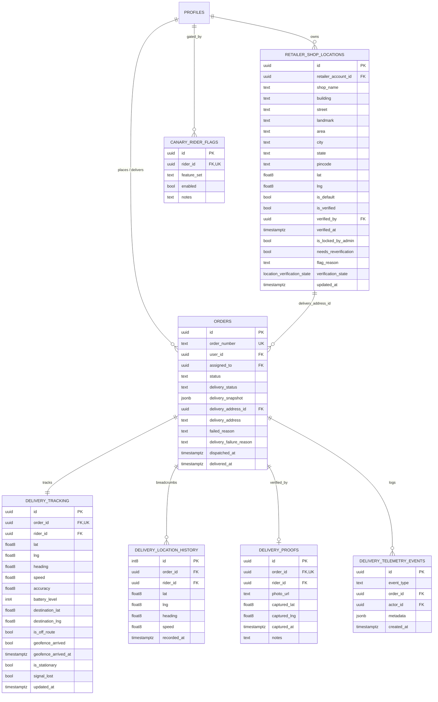
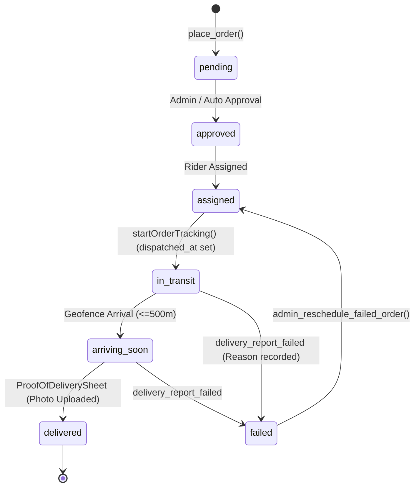
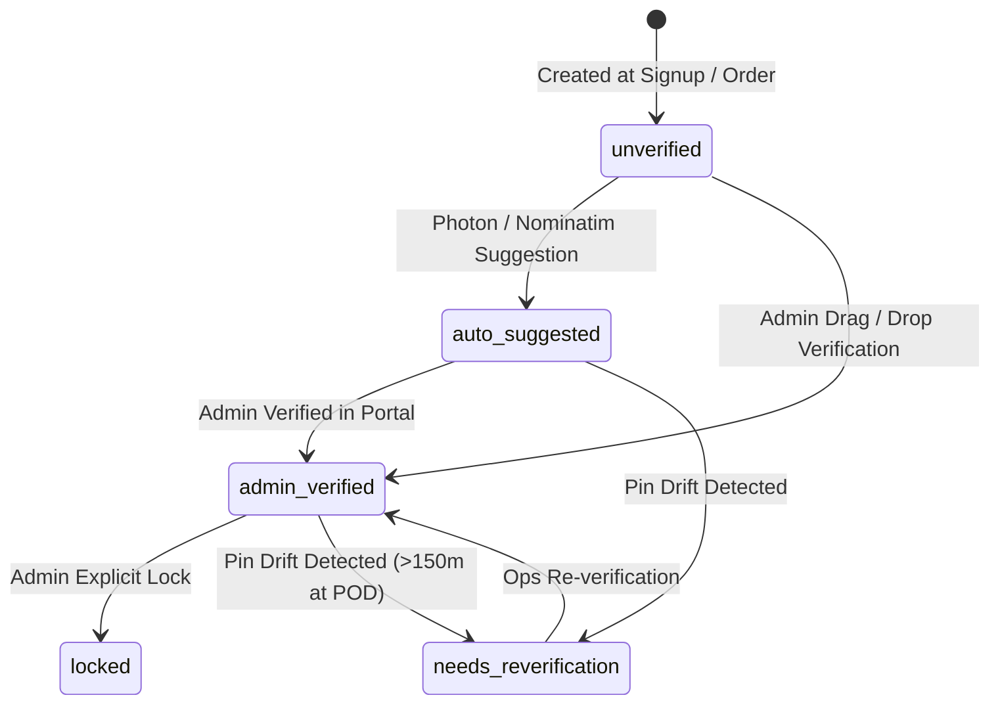

# Thakkar Medico — Live Delivery Tracking Subsystem: Definitive Architecture

This document serves as the authoritative technical architecture and operational reference for the **Thakkar Medico Live Delivery Tracking Subsystem**, spanning database schema, state machines, realtime communication, telematics ingestion, drop pin resolution, and operational maintenance.

---

## 1. System Overview & Architecture Goals

The live delivery tracking subsystem coordinates high-accuracy GPS broadcasting from delivery riders to customer tracking pages (`track.html`), admin dispatch dashboards, and mobile driver applications.

```
┌─────────────────────────────────────────────────────────────────────────────┐
│                             HIGH-LEVEL TOPOLOGY                             │
└─────────────────────────────────────────────────────────────────────────────┘
                                                                               
   ┌────────────────────┐                          ┌───────────────────────┐   
   │  Rider Mobile App  │                          │ Customer Live Track   │   
   │ (Expo / React Native)                         │ (Zero-RPC Web Page)   │   
   └────┬───────────┬───┘                          └───────────▲───────────┘   
        │           │ (Postgres Sync: 30s)                     │ (Realtime WS) 
        │ (Hot Path │                                          │               
        │ GPS: ~4s) ▼                                          │               
        │  ┌───────────────────────────────────────────────────┴───────────┐   
        │  │               Supabase PostgreSQL Backend                     │   
        ▼  │                                                               │   
 ┌─────────┐  • delivery_tracking           (Latest Durable State & Sync)  │   
 │ Upstash │  • delivery_location_history   (Throttled Breadcrumbs Trail)  │   
 │  Redis  │  • orders                      (Lifecycle & Frozen Snapshot)  │   
 │ Hot-Path│  • retailer_shop_locations     (Master Physical Shop Pin)     │   
 │ (30sTTL)│  • delivery_proofs             (Geotagged Photo POD Records)  │   
 └─────────┘  • delivery_telemetry_events   (Diagnostics & Circuit Breaker)│   
           └────────────────────────┬──────────────────────────────────────┘   
                                    │                                          
                                    ▼ (Realtime WS & RPC)                      
                         ┌───────────────────────┐                             
                         │ Admin Command Center  │                             
                         │ (Fleet Map / Portal)  │                             
                         └───────────────────────┘                             
```

### Core Design Principles
1. **Zero-RPC In-Transit Rendering:** Customer tracking pages consume live GPS directly from Supabase Realtime WebSocket payloads (`delivery_tracking` UPDATE events) and compute distances, ETA, and progress bar percentages in-place without issuing database queries.
2. **Dual-Layer Telematics Ingestion (Redis Hot Path + Throttled Postgres Sync):**
   * **Hot Path (Option 1: 10s Cadence):** Live GPS writes directly to Upstash Redis REST every ~10s per rider with explicit 90s TTL (3:1 ratio against 30s sync to prevent expiration races), protecting Postgres from write saturation and supporting 5–6 concurrent riders under the 500K monthly quota.
   * **Durable Sync (30s Cadence):** Periodic sync every 30s persists latest state to `delivery_tracking` (triggering Supabase Realtime broadcast) and `delivery_location_history` (if displacement >25m).
   * **Fail-Open Resilience:** If Redis is unreachable or quota exhausted, the client automatically degrades to direct Postgres writes.
3. **Snapshot vs Live Truth Isolation:**
   * **Active Orders:** Authoritative verified shop locations (`is_verified = true`) take precedence over stale order snapshots.
   * **Delivered Orders:** Historical orders lock onto `orders.delivery_snapshot` as immutable Layer 1 truth so historical records never alter if a shop moves in the future.
4. **Motion-Aware Battery Optimization:** Continuous background GPS tracking runs while the rider is in motion; motionless pauses (>30 minutes) set `is_stationary = true` and reduce broadcast frequency until displacement >25m is detected.

---

## 2. Entity Relationship Diagram (ERD) & Table Ownership

### Overlapping State Notice: `delivery_tracking` vs `driver_locations`
The system currently maintains two tables holding driver positional data:
1. **`delivery_tracking` (Authoritative Layer 1 Truth):** Keyed by `order_id UNIQUE`. Holds authoritative telematics, battery, geofence, and destination coordinates for in-flight customer orders. Consumed by customer `track.html` and admin single-order tracker `[orderId].tsx`.
2. **`driver_locations` (Fleet Overview Reader Table):** Keyed by `profile_id UNIQUE`. Used exclusively by the Admin Fleet Overview Screen (`app/admin/delivery-tracking.tsx`) to render all online drivers simultaneously across Nagpur on a single multi-driver map.
* **Follow-up Consolidation Ticket (TM-TRACK-F1):** Migrate Admin Fleet Overview Screen to aggregate directly from `delivery_tracking` / Redis driver keys and deprecate `driver_locations`.



---

## 3. Authoritative Drop Pin Resolution Specification

The master SQL resolver `resolve_order_destination_coordinates(p_order_id)` and client TypeScript ladder `orderDeliveryCoords.ts` execute the exact same 7-step priority ladder:

```
┌─────────────────────────────────────────────────────────────────────────────┐
│                   DROP PIN RESOLUTION PRIORITY MATRIX                       │
└─────────────────────────────────────────────────────────────────────────────┘

 [1] Is Order Terminal? (delivered / failed / cancelled)
     │
     ├── YES ──► Check delivery_snapshot ──► [Layer 1 Immutable Snapshot Truth]
     │
     └── NO (Active In-Flight Order)
          │
          ├── [2] Explicit delivery_address_id & is_verified = true?
          │       └── YES ──► [Authoritative Verified Shop Location Pin]
          │
          ├── [3] Retailer Profile has is_verified = true Default Shop?
          │       └── YES ──► [Authoritative Verified User Default Pin]
          │
          ├── [4] delivery_snapshot has valid lat/lng (!= 0)?
          │       └── YES ──► [Order Placement Snapshot Pin]
          │
          ├── [5] Explicit delivery_address_id has coordinates (unverified)?
          │       └── YES ──► [Unverified Shop Location Pin]
          │
          ├── [6] orders.destination_lat / delivery_tracking.destination_lat?
          │       └── YES ──► [Orders Table Fallback Pin]
          │
          └── [7] Final Fallback ──► [Nagpur Warehouse Centroid (21.1501, 79.0991)]
```

---

## 4. State Machines & Transitions

### A. Order Delivery Lifecycle


### B. Shop Location Verification State (`location_verification_state`)


---

## 5. Telemetry, Drift Detection & Circuit Breakers

### A. Post-Delivery Pin Drift Detection (`evaluate_delivered_order_pin_drift`)
When an order transitions to `delivery_status = 'delivered'`, database trigger `trg_orders_flag_pin_drift` evaluates the physical delivery location against the registered shop pin:
* **Distance Threshold:** 150.0 meters.
* **Evaluation Coordinates:**
  1. Primary: `delivery_proofs.captured_lat` / `captured_lng` (geotagged at photo shutter click).
  2. Fallback: Centroid of last 5 breadcrumbs in `delivery_location_history`.
* **Remediation Action:** If distance >150m and `is_locked_by_admin = false`, sets `needs_reverification = true`, `flag_reason = 'drift_detected'`, and logs to `delivery_integrity_health_log`.

### B. Client-Side Telemetry & Circuit Breakers
For riders in the canary cohort (`canary_rider_flags.enabled = true`), the client monitors stability:
* **Rapid Recalculations (>1/min for 3m):** Trips circuit breaker to standard navigation mode.
* **Excessive Reconnections (>2/shift):** Trips circuit breaker and holds session in baseline mode.
* **Granular Events Logged:** `auto_circuit_breaker_triggered`, `rider_reported_issue`, `realtime_reconnect`, `off_route_recalculation`, `destination_shifted`.

---

## 6. Master RPC Directory

| Function Name | Security | Target Tables | Primary Consumers |
| :--- | :--- | :--- | :--- |
| `get_public_order_tracking(text)` | Security Definer (Anon/Auth) | `orders`, `delivery_tracking`, `retailer_shop_locations`, `delivery_proofs` | Public Customer `track.html` |
| `get_order_tracking_bundle(uuid)` | Security Definer (Anon/Auth) | Delegates to `get_public_order_tracking` | Admin Per-Order Tracker `[orderId].tsx` |
| `resolve_order_destination_coordinates(uuid)` | Security Definer (Anon/Auth) | `orders`, `retailer_shop_locations`, `delivery_tracking` | Master Single Source Resolver |
| `get_active_order_for_rider(uuid)` | Security Definer (Auth) | `orders`, `retailer_shop_locations`, `order_items` | Rider Mobile Screen `active-delivery.tsx` |
| `get_delivery_health_summary(bool)` | Security Definer (Auth) | `delivery_telemetry_events`, `delivery_integrity_health_log`, `delivery_tracking` | Admin Fleet Dashboard `app.js` |
| `check_geofence_arrival(uuid, uuid, float8, float8)` | Security Definer (Auth) | `orders`, `delivery_tracking` | Mobile Geofence Watcher |
| `run_delivery_subsystem_daily_maintenance()` | Security Definer (Auth) | `delivery_location_history`, `delivery_telemetry_events`, `public_tracking_rate_limits` | Daily Cron / Admin Maintenance UI |
| `toggle_rider_canary_flag(uuid, bool, text, text)` | Security Definer (Auth) | `canary_rider_flags` | Admin Canary Controls |
| `apply_shop_location_suggestion_v2(...)` | Security Definer (Auth) | `retailer_shop_locations`, `location_corrections` | Address Correction Ops Portal |
| `reconcile_historical_delivered_order_snapshots(bool)` | Security Definer (Auth) | `orders`, `retailer_shop_locations`, `delivery_integrity_health_log` | Integrity Audit Runner |

---

## 7. Data Retention & Maintenance Runbook

| Table | Retention Window | Purge Function | Execution Cadence |
| :--- | :--- | :--- | :--- |
| `delivery_location_history` | **7 Days** | `purge_old_delivery_location_history(7)` | Daily at 03:00 AM IST (21:30 UTC) |
| `delivery_telemetry_events` | **30 Days** | `purge_old_delivery_telemetry_events(30)` | Daily at 03:00 AM IST (21:30 UTC) |
| `public_tracking_rate_limits` | **10 Minutes** | `purge_expired_tracking_rate_limits()` | Daily at 03:00 AM IST (21:30 UTC) |
| `delivery-photos` (Storage) | **90 Days** | Supabase Storage Lifecycle Policy | Automated by Storage Engine |

### pg_cron Daily Scheduling Snippet
```sql
CREATE EXTENSION IF NOT EXISTS pg_cron;

SELECT cron.schedule(
  'delivery_subsystem_daily_maintenance',
  '30 21 * * *',
  $$ SELECT public.run_delivery_subsystem_daily_maintenance(); $$
);
```
